# 1. Einleitung
## 1.1 Zielsetzung
In der folgenden Arbeit soll zur Teilaufgabe objektorientierter Programmierung (OOP) entsprechend der Aufgabenstellung ein Beispielprogramm entwickelt werden, welches die Prinzipien dieses Paradigmas veranschaulichen kann. Nach Darstellung der theoretischen Grundlagen und Konzepte soll dann auf der Basis des Beispielprogramms, die Umsetzung der beschriebenen Konzepte, sowie ihre Anwendung zur Problemlösung in der Praxis diskutiert werden. 
Der Schwerpunkt soll dabei nicht nur in der technischen Umsetzung, sondern auch in der kritischen Diskussion getroffener Designentscheidungen liegen.
Insbesondere sollen dabei die Möglichkeiten der Nutzung von Vererbung und Methodenüberschreibung zur Spezialisierung von Klassen gezeigt werden, und dabei die expliziten und impliziten Folgen aus diesen Designentscheidungen diskutiert werden. 

## 1.2 Grundidee des Beispielprogramms 
Zur Veranschaulichung dieser Kernprinzipien wird ein Programm entwickelt, welches als Teil eines hypothetischen Computerspiels verstanden werden kann.
Die Grundidee ist, dass in einer zweidimensionalen Spielwelt segelnde Kriegsschiffe gesteuert werden können, welche auf gegnerische Schiffe schießen und diese versenken können. Zusätzliche Spielobjekte sind Sandbänke, Felsen und Festungen. Das entwickelte Programm konzentriert sich stark auf die semantischen Zusammenhänge zwischen den Objekten, den Schnittstellen, über welche sie miteinander interagieren und die Klassen-/ Vererbungshierarchien, welche genutzt werden um die Semantik zu modellieren. Es bietet dabei keine Implementierung von Spielmechaniken, welche für eine tatsächlich Nutzung notwendig wären, soll aber aufzeigen, wie Teilsysteme mit den implementierten Objekten interagieren könnten. 

## 1.3 Verwendete Klassen 
Dazu werden die im Klassendiagramm, mit ihren öffentlichen Methoden (API), dargestellten Klassen verwendet.
Bereits an dem Klassendiagramm lassen sich nicht ganz intuitiv und sinnvoll erscheinende Methoden und Beziehungen zwischen den Klassen erkennen (z.Bsp. SandBank erbt eine set_velocity Methode oder CannonBall prüft auf Kollision). Diese werden später kritisch diskutiert. 

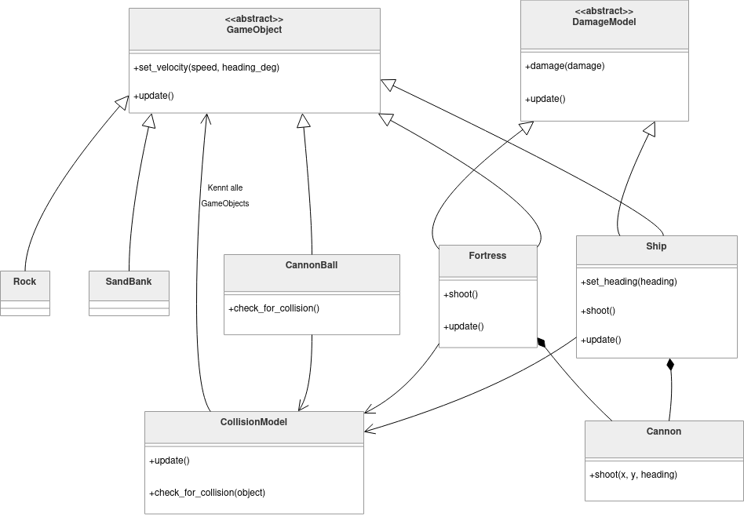

# 2. Theoretische Grundlagen
## 2.1 Paradigmen des Programmierens 
Paradigmen des Programmierens beschreiben die grundlegend unterschiedlichen Ansätze, wie man Programme strukturieren und Problemlösungen modellieren kann. Objektorientierte Programmierung ist eine Teilmenge dieser Paradigmen.
Einen Überblick über wichtige Paradigmen liefert Robert Sebesta in seinem Buch "Concepts of Programming Languages" [@sebesta2016].
Es lässt sich ihm nach grundlegend zwischen imperativen und deklarativen Paradigmen unterscheiden. 
Fundamentale Charakteristik in imperativer Sprache geschriebener Programme ist, dass sie Zustände modellieren, welche sich während der Programmausführung verändern [@sebesta2016, S. 659]. Dieser Kontrollfluss wird dabei mittels expliziter Anweisungen gesteuert. 
Programme, die wiederum einem deklarativen Paradigma folgen, beschreiben das gewünschte Ergebnis und dessen Eigenschaften, während sie die konkrete Ausführung dem System überlassen [@sebesta2016, S. 714]. 
Zu den wichtigsten deklarativen Paradigmen gehören die funktionale und die logische Programmierung.
Funktionale Programmierung basiert auf mathematischen Funktionen. Das hat unter anderem zur Folge, dass (in rein funktionalen Sprachen) Funktionen keine Nebenwirkungen haben, da sie keine nicht-lokalen oder globalen Variablen zur Berechnung nutzen [@sebesta2016, S. 660].
Rein funktionale Sprachen nutzen keine Variablen oder Zuweisungsausdrücke. Wiederholung wird durch Rekursion nicht Iteration modelliert [@sebesta2016, S. 662].
Logische Programmierung basiert hauptsächlich auf formaler Logik 
Programme, die logischer Programmierung folgen stellen demnach Sammlungen von Fakten und Regeln dar, welche das System interpretiert. Diese Programme sind dann insofern nutzbar, als dass ihnen Fragen gestellt werden können, welche sie auf Basis der ihnen bekannten Regeln und der formalen Logik beantworten können [@sebesta2016, S. 714].
Zu den wichtigsten imperativen Paradigmen gehören die prozedurale und objektorientierte Programmierung.
Bei prozeduraler Programmierung steht die Ablaufsteuerung des Programms mit sequenzieller Ausführung im Vordergrund und Zustandsänderungen werden über Variablen und Parameter modelliert. Dabei wird mit einer Abfolge von Anweisungen auch die Art und Weise der Programmausführung explizit beschrieben. 
Objektorientierte Programmierung hingegen fokussiert sich auf die Abstraktion von Daten und Datentypen. Dabei werden Daten und Verhalten gekapselt, wodurch Objekte entstehen. Diese können dann miteinander interagieren [@sebesta2016, S. 515]. 

## 2.2 Objektorientierte Programmierung

### 2.2.1 Kapselung  
Kapselung bedeutet, dass Daten und die, auf diese Daten bezogenen Methoden, in einer Einheit gebündelt werden. Dies unterstützt die technische Trennung von Implementierung und Schnittstelle.
[@voigt2010] stellen dar, dass die Nähe von Methoden zu den Daten, auf welchen sie operieren, eine zentrale Charakteristik von Objektorientierung ist. 
Dabei ist Kapselung kein Konstrukt, welches exklusiv in objektorientierter Programmierung verwendet wird. In anderen Paradigmen findet die Kapselung unter anderem durch Modul- und Dateigrenzen statt [vgl @voigt2010, S. 172]. Bei objektorientierter Programmierung wird die Kapselung durch Sprachmechanismen explizit unterstützt, da auf die gekapselten internen Repräsentationen einer Einheit nur noch über definierte Schnittstellen zugegriffen werden kann. 
 
Kapselung wurde im Beispielprojekt vielfach in Form von Klassendefinitionen umgesetzt. Besonders deutlich zeigt sich das in der Basisklasse GameObject, wo mit dem "property decorator" versehende Methoden implementiert wurden.    

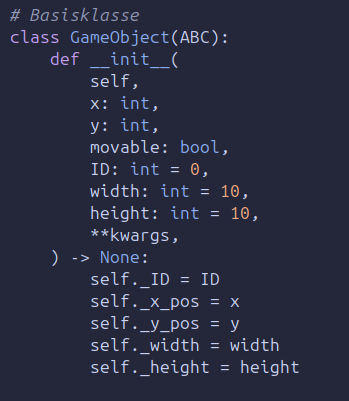{ width=50% }

Die Kapselung, im Sinne von Bündelung der Daten zu einer Einheit, findet statt, indem die Daten als Attribute der Instanz zugeordnet werden. Damit befinden sie sich nicht mehr frei im globalen Namensraum, sondern sind der jeweiligen Instanz der Klasse GameObject zugeordnet. Zugriffe von außen folgen der Syntax "instanzname.attribut". Damit sind die internen Repräsentationen nicht mehr im globalen Namensraum verfügbar (wie hier zum Beispiel x, y), sondern an die jeweilige Instanz gebunden. Das gilt sowohl für Attribute, als auch für Methoden. Attribute sind damit in Python jedoch nicht schreib- oder lesegeschützt. 
Im Beispielprogramm werden bei der Instanzierung der Instanzattribute diese zusätzlich durch das "_" Präfix per Konvention als "private" gekennzeichnet.
Das macht deutlich, dass auf diese Attribute nicht von außerhalb der Klasse zugegriffen werden soll. Während einige Sprachen, wie C++ versuchte Zugriffe von außen durch den Compiler verhindern, erfolgt der Schutz vor Zugriff von außen in Python, bei privaten Attributen vor allem über Konvention. Daher sind Lesezugriffe auf Attribute (je nach Implementierung mit mehr oder weniger Aufwand) immer möglich. Regelmäßig möchte man Schreibzugriffe ausschließlich über definierte Schnittstellen ermöglichen, um zum Beispiel Typsicherheit zu gewährleisten oder die Menge erlaubter Eingabewerte zu definieren.
Ein Beispiel dafür sind im Beispielprogramm die _x und _y Attribute von GameObjects, welche deren Position in der Spielwelt repräsentieren. Hier ist es nicht gewünscht, dass sie von außen manuell zugewiesen werden können. Stattdessen sollen GameObjects einmal an einer gegebenen Position instanziert werden. Während der Programmausführung soll von außen nur noch, über die Schnittstelle der Instanzmethode set_velocity(self), die Dynamik des Objektes (_speed und _heading) verändert werden.
Intern wird diese Dynamik dann bei Aufruf der update() Methode (über eine interner Helfermethode) auf die Positionsdaten angewendet. Mit diesem Vorgehen kann die Gültigkeit des Zugriffes sichergestellt werden. 

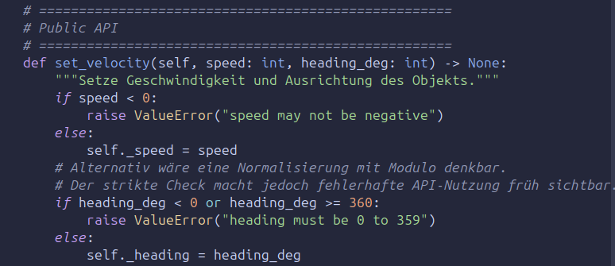{ width=80% }
 
Um diesen Designansatz konsequent zu stärken wurden im Beispielprogramm folgende Instanzmethoden in der Klasse GameObjects definiert:

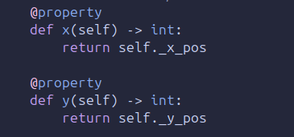{ width=50% }

Durch den "property decorator" wird der Zugriff auf ein Attribut über eine Methode vermittelt, ohne, dass sich die Syntax für den zugreifenden Nutzer ändert. 
Ein Ausdruck wie instanz.x stellt nun einen Lesezugriff auf das instanz._x Attribut dar, während die Zuweisung instanz.x = ... ungültig wird, da x intern eine Methode darstellt, welcher kein Wert zugewiesen werden kann. Damit ist mit einer Mischung aus Konvention (instanz._x = ... ist immer technisch noch möglich) und technischer Umsetzung mittels "property decorator" eine Trennung zwischen interner Repräsentation und externer Nutzung erreicht.    

### 2.2.2 Abstraktion  
Abstraktion ist ein Konzept, welches die Details, **wie** etwas funktioniert vor dem Nutzer versteckt, während ihm gleichzeitig ermöglicht wird, komplexe Funktionalität zu nutzen. Das Gesamtsystem wird also in seiner Komplexität auf ein Modell reduziert, also auf wesentliche Eigenschaften beschränkt. 
Zur Veranschaulichung gibt es das Modell der Abstraktionsgrenze. Auf der einen Seite dieser Grenze steht die Nutzung der Abstraktion und auf der anderen Seite die Implementierung. Die Abstraktionsgrenze wird während der Softwareentwicklung definiert und die richtige Wahl der Abstraktionsebenen stellt ein wichtiges Qualitätsmerkmal dar [vgl. @jue].
Abstraktion findet dabei auf unterschiedlichsten Ebenen statt und auch sie ist weder ein exklusives Konzept der objektorientierten Programmierung, noch der Informatik selbst. 
Sie ist jedoch ein zentrales Konzept der Informatik und objektorientiertes Programmieren ermöglicht es, sehr granulare Abstraktionen zu definieren. Abstraktion stellt dabei vor allem ein Mittel gegen Komplexität dar [@sebesta_2016, S. 473]. 
Abstraktion und Kapselung wirken ähnlich, was dadurch verstärkt wird, dass sie oft durch dieselben Sprachmechanismen umgesetzt werden. 
So führt eine Klassendefinition gleichzeitig zur Kapselung ihrer Attribute (Verbergen im technischen Sinne der Sichtbarkeit) als auch zu Abstraktion, da für den Nutzer zugrunde liegende Implemtierungsmechanismen abstrahiert werden. Dieser kann die komplexen Implementierungsmechanismus über den simplen Aufruf der Konstruktor Methode nutzen (Verbergen im Sinne von Komplexitätsreduktion durch Vereinfachung).
Es können in der Informatik zwei grundlegende Abstraktionsarten unterschieden werden. Zum einen gibt es die Abstraktion von Daten und zum anderen die Abstraktion von Prozessen [@sebesta_2016, S. 473]. Die Abstraktion von Daten zeigt sich bereits auf der Ebene grundlegender Datentypen von Programmiersprachen. So wird zum Beispiel ein String in Python als abstrakter Datentyp bereitgestellt, dessen nicht unerheblich komplexe interne Repräsentation und Speicherverwaltung dem Nutzer verborgen bleibt.
Im Beispielprogramm zeigt sich Datenabstraktion vor allem an der Verwendung der, von Enum erbenden, Subklasse DamageState. 

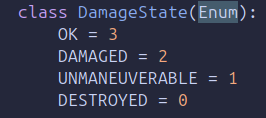{ width=40% }

Im Beispielprogramm wird die Mechanik zwar hauptsächlich zur semantischen Strukturierung, Einschränkung des Wertebereichs, sowie zur Vermeidung von Stringvergleichen genutzt, jedoch handelt es sich bei den Attributen um Variablen mit den typisierten Eigenschaften eines Enums. Für den Leser sind die Ausdrücke immer noch leicht als Wörter interpretierbar, während sie im Vergleich zu einem String auf Datenebene unterschiedlich repräsentiert sind, was u.a. numerische Vergleiche ermöglicht.
Prozessabstraktion wird am deutlichsten mit Methodendefinitionen/-aufrufen an verschiedenen Stellen (z.Bsp. s.o. set_velocity Methode von GameObjects) angewendet. Dem Aufrufer muss hierbei lediglich die Signatur der Methode bekannt sein. Dadurch kann die kognitive Last beim Aufrufer reduziert werden, da lediglich die Schnittstelle bekannt sein muss und die Komplexität der Implementation nicht zwingend Auswirkung auf die Nutzung der Schnittstelle hat. 

### 2.2.3 Vererbung/Komposition
Einer der großen Vorteile objektorientierter Programmierung, welcher sich durch Kapselung, Abstraktion und Schnittstellendefinitionen ergibt, ist, dass Teile von Programmcode sehr einfach wiederverwendet werden können. Dies kann neben der Nutzung von Schnittstellen als Client durch Vererbung oder Komposition Gebrauch gemacht werden, deren Verhältnis häufig mit den Ausdrücken "Ist ein" und "hat ein" beschrieben wird [@salim_nodate].
Im Beispielprogramm ist beides an verschiedenen Stellen implementiert. 
So erben mehrere Klassen von der Klasse GameObject.

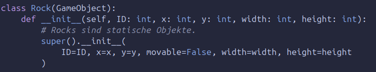{ width=80%}

Das führt dazu, dass nach rock_1 = rock(...) rock_1 Zugriff auf alle Attriute und Methoden der Klasse GameObjects bereitstellt. 
Semantisch und technisch bedeutet dies, dass Rock ein GameObject **ist**. Rock bietet hier keine über GameObject hinausgehende Funktionalität. 
Im Gegensatz dazu erweitert die Klasse Ship die, von GameObjects bereitgestellten, Attribute und Methoden, was als Spezialisierung bezeichnet wird. Spezialisierung kann auch in Form von Komposition erfolgen. 
Diese ist auf zwei leicht unterschiedliche Arten im Code umgesetzt. Zum einen gibt es die eigenständige Klasse Cannon, deren Funktionalität von anderen Klassen integriert wird, indem Klassenattribute von Ship und Fortress als Cannon Objekt instanziert werden.

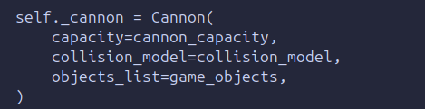{ width=60% }

Nun **hat** Ship ein Cannon Objekt und die Attribute und Methoden von Cannon werden über das Instanzattribut self._cannon von Ship bereitgestellt. 
Mit shipinstance._cannon.capacity lässt sich auf das Cannon zugehörige Attribut capacity zugreifen. Dass dieser direkte Zugriff möglich ist, zeigt, dass die interne Struktur öffentlich ist und keine strikte Kapselung stattfindet. 
Das oben bereits angeführte Beispiel DamageState wurde im Beispielprogramm nicht im globalen Namensraum definiert, sondern als verschachtelte Klasse innerhalb von DamageModel. Dies sorgt für eine zusätzliche semantische Bindung an die äußere Klasse.
Während Cannon sinnhaft durch verschiedene Klassen mittels Komposition integriert werden kann, gehört der DamageState eindeutig zu dem Damage Model. Das wird dem Nutzer spätestens klar, wenn er zur Komposition über den Namensraum DamageModel auf DamageState zugreifen müsste. 
Die Definition innerhalb einer anderen Klasse führt jedoch nicht zur Komposition, da hierdurch keine Objektbeziehung hergestellt und keine Funktionalität übernommen wird. Erst wenn, wie im Beispiel, eine Instanz von DamageState einem Instanzattribut von DamageModel zugewiesen wird, besteht die Objektbeziehung und es kann von Komposition gesprochen werden. Diese ist technisch identisch mit der Komposition von nicht verschachtelten Klassen. 

### 2.2.5 Polymorphie und Methodenüberschreibung 
Der Begriff Polymorphie ist im Kontext von Software nicht ganz eindeutig, und wird in unterschiedlichen Quellen verschieden streng ausgelegt. Im sprachlichen Sinn bedeutet Polymorphie Vielgestaltigkeit. Die Polymorphie dient dabei bei objektorientierter Programmierung vor allem der "flexiblen Auswahl geeigneter Methoden identischen Namens anhand des Objekttyps und der Argumentenliste" [@steyer2024, S. 176]. 
[@kang2010, S. 28] definieren Polymorphismus praxisorientiert als die Fähigkeit als Typ A zu erscheinen und genauso nutzbar zu sein, wie ein anderer Typ B. 
Diese Definition scheint viele Mechaniken objektorientierter Programmierung zu beschreiben. 
Um das Konzept differenziert darzustellen, soll zunächst einmal negativ abgegrenzt werden.
Im Beispielprogramm ist die Methode shoot() sowohl als Instanzmethode der Klasse Cannon, als auch als Instanzmethode der Klasse Ship implementiert. 

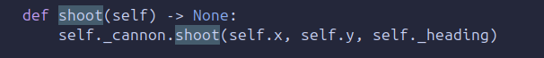{ width=60% }

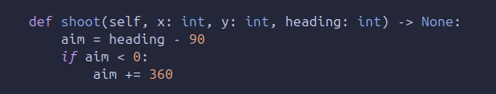{ width=70% }

Die Sinnhaftigkeit dieser Implementierung wird später kritisch diskutiert. 
Wird nun die Methode shoot() durch den Nutzer auf einer Instanz aufgerufen, gibt es intuitiv verstanden zwei Methoden mit identischem Namen. Die ausgeführte Implementierung wird während der Laufzeit durch den Interpreter aufgelöst. Das entspricht auf den ersten Blick der Definition von Polymorphismus, da eine Auswahl der Methode bei identischem  Methodennamen anhand des Objekttyps stattfindet. 
Es ist jedoch zu bedenken, dass zwar beide Implementierungen von shoot() den gleichen Namen tragen, es sich faktisch jedoch um zwei unterschiedliche Methoden, welche nicht über die gleiche Schnittstelle abstrahiert sind, sondern isoliert und gekapselt in unterschiedlichen Klassen und Namensräumen definiert werden handelt. 
ship.shoot() und cannon.shoot() rufen zwei unterschiedliche Methoden mit unterschiedlicher Definition auf, welche im Beispielprogramm nicht technisch strukturell gleich, sondern lediglich semantisch eng miteinander verknüpft sind. 

Polymorphie im engeren Sinn findet sich im Beispielprogramm bei der update() Methode. Diese wird das erste Mal in der Basisklasse GameObject definiert.

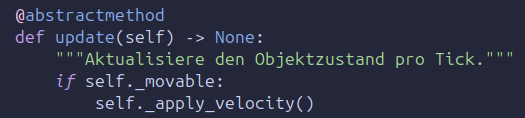{ with=70% }

Anschließend ebenso in den davon erbenden Klassen Rock und Ship. 

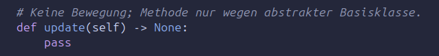{ width=50% }

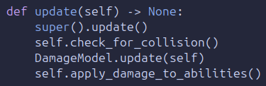{ width=75%}

Dieses Vorgehen nennt sich Methodenüberschreibung. Wenn die in der Basisklasse implementierte Methode von der Subklasse nicht implementiert wird, steht für Instanzen der Subklasse die Implementierung der Basisklasse zur Verfügung. Wird sie jedoch in der Subklasse ebenfalls implementiert, überschreibt diese Implementierung für Instanzen der Subklasse die Implementierung der Basisklasse.
Diese Methodenüberschreibung erfolgt hier bei Rock und Ship auf unterschiedliche Art. 
Rock überschreibt die update() Methode der Basisklasse mit pass. rockinstance.update() ruft nicht mehr die Implementierung von GameObject auf, sondern die eigene; macht also nichts. Das ist als Designentscheidung kritisch zu hinterfragen (siehe Diskussion). 
Ship überschreibt ebenfalls die Implementierung von GameObject, ruft allerdings als erstes mit super().update() (in diesem Fall!) diese Implementierung der Basisklasse auf. Danach wird die Implementation von update() um weitere Aufrufe erweitert und somit spezialisiert.
In der Datei mainprogramm.py welche einen kleinen Teil des Programmflusses steuern würde, findet folgender Aufruf statt: 

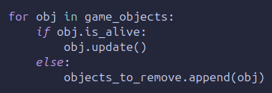{ width=60% }

Bei game_objects handelt es sich um eine Liste, welche alle instanzierten Objekte beinhaltet, die von GameObjects erben (und damit wie oben dargestellt ein GameObject **sind**).
Über diese wird nun iteriert und auf jedes enthaltene Objekt, die für dieses Objekt implementierte update() Methode aufgerufen. 
Dabei handelt es sich um eine polymorphe Schnittstelle, da alle Objekte einheitlich angesprochen werden, während die konkrete Ausführung abhängig vom jeweiligen Objekttyp variiert. Diese Verhaltensvarianz wird vom Typ des Objektes implizit gehalten und mitgebracht.
Polymorphie entsteht somit nicht durch die Implementierung von Methoden mit gleichem Namen allein, sondern durch die einheitliche Nutzung dieser an einer gemeinsamen Schnittstelle. 
Würden die verschiedenen Implementierungen von update() lose verstreut über das Programm, einzeln über ihre Instanzen, aufgerufen werden, wäre das Konzept nicht in gleichem Maße umgesetzt. 

### 2.2.6 Abstrakte Klassen und Methoden 
Wenn normale Klassen vereinfacht gesagt Baupläne für den Interpreter zum Instanzieren von Objekten sind, dann sind abstrakte Klassen Baupläne für den Programmierer zum Entwerfen von Klassen.
In Python wird eine Klasse abstrakt, wenn sie von ABC erbt und mindestens eine abstrakte Methode beinhaltet. Das führt dazu, dass diese Klasse nicht mehr direkt instanzierbar ist. Das Prinzip ist im Beispielprogramm sowohl bei GameObject, als auch bei dem DamageModel umgesetzt. Die semantische Sinnhaftigkeit ist beim DamageModel besonders prägnant. Da es als Fähigkeit, bzw. Mechanik eines Objektes modelliert ist, hätte es ohne dieses keine eigenständige Bedeutung. Deswegen ist eine direkte Instanzierung unerwünscht. 
Abstrakte Methoden haben die Eigenschaft, dass sie durch die Klasse, welche von der abstrakten Klasse erbt, implementiert werden **müssen**, wenn die erbende Klasse instanziert werden soll. Damit wird ein Vertrag definiert, der die Konsistenz der Implementierung in dieser Hinsicht garantiert.
Bei dem DamageModel sind die check_for_collision() und apply_damage_to_abilities() Methoden abstrakt. Diese sollen garantieren, dass Objekte, welche das Schadensmodell integrieren, auch prüfen, ob es zu einer Kollision gekommen ist und das Schadensmodell angewendet werden muss.
Diese Methoden sind als klassische abstrakte Methoden ausgelegt, welche lediglich die Schnittstelle und ihre Signatur festlegen.
Bei der oben dargestellten update() Methode der GameObject Klasse ist der abstractmethod decorator ebenfalls sinnvoll verwendet. Damit wird garantiert, dass alle von GameObject abgeleiteten Instanzen eine update() Methode zur Verfügung stellen. Deshalb kann über die Liste der GameObjects iteriert werden, ohne dass bei Aufruf die Gültigkeit des update() Aufrufes sichergestellt werden muss. 
Durch diese abstrakte Methode wird zusätzlich ein Default-Verhalten bereit gestellt, welches übernommen, erweitert oder überschrieben werden kann. 

### 2.2.7 Mehrfachvererbung und kooperative Methoden
Mehrfachvererbung findet im Beispielprogramm bei den Klassen Ship und Fortress statt. An diesem Beispiel lässt sich die Komplexität von Mehrfachvererbung und die Notwendigkeit für kooperative Methoden zur sauberen Instanzierung aufzeigen. 
Grundlage ist die Method Resolution Order (MRO) von Python, welche die Reihenfolge festlegt, in welcher die übergeordneten Klassen nach passenden Implementierungen durchsucht werden. Zusätzlich werden von der MRO Konflikte aufgelöst, wenn zwei übergeordnete Klassen eine gleichnamige Methode bereitstellen [@steyer2024, S. 208]. Das ist bei der Instanzierung von Ship und Fortress relevant, da sowohl GameObject, als auch DamageModel eine `__init__()` Methode implementieren.
Das bedeutet, dass Ship bei der Instanzierung die für beide übergeordneten `__init__()` Methoden erwarteten Parameter bereitstellen und korrekt weitergeben muss. Das wird im Beispielprogramm wie folgt mit kooperativen Methoden umgesetzt:

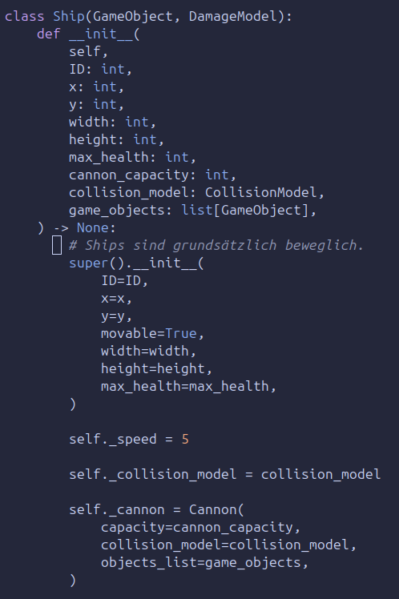{ width=80% }

Wird der Konstruktor Ship() aufgerufen, werden zunächst einige Argumente an `super().__init__(...)` übergeben. super() ruft die nächste Implementierung von `__init__` in der MRO auf, welche abhängig von der Reihenfolge in den Klammern der Klassendefinition Ship ist. Das ist im Beispiel die `__init__()` Methode von GameObject
In dieser werden die benötigten benannten Parameter an die entsprechenden Argumente gebunden. Die Verwendung von **kwargs ermöglicht eine unbestimmte Menge von unbekannten, benannten Parametern weiterzugeben.

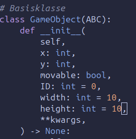{ width=90% }

Diese werden am Ende der Methode wieder mit super() an die nächste Implementierung von update() in der MRO weitergegeben.

{ width=50% }

Im Beispiel handelt es sich bei dem **kwargs Parameter, der von GameObject `__init__()` weitergegeben wird, um max_health. Die nächste Implementierung in der MRO ist in der Klasse DamageModel zu finden . 
Daran wird sichtbar, dass super() technisch nicht zwingend die Methode der Elternklasse (was hier ABC wäre) aufruft, sondern die Methode, der als nächstes in der MRO erscheinenden Klasse. 
Ohne den `super().__init__(...)` Aufruf in GameObject würde die MRO Kette dort enden. Dann könnten keine Parameter an DamageModel weitergegeben werden und die Initialisierung von mehreren Elternklassen wäre nicht möglich. 
In DamageModel `__init__()` wird ebenfalls `super().__init__(...)` aufgerufen, damit weitere Klassen als zusätzliche Basisklassen möglich bleiben.

# 3. Diskussion
## 3.1 Wann ist ein Objekt eine Klasse?-Probleme intuitiver Objektmodellierung
Objektorientierte Programmierung ermöglicht Semantik, Verantwortung und Verhalten in Objekten zu bündeln. Das ist relativ ähnlich zur intuitiven Beschreibung realer Objekte (Schiffe, Autos, Tiere etc.). Alltagsnahe Beispiele, wie "Ein Schiff hat eine Kanone und kann damit schießen" können leicht als Klasse in die Vererbungshierarchie integriert werden. Diese Nähe zum intuitiven Verständnis von Objekten kann insofern irreführend sein, dass nicht jede sprachlich identifizierbare Entität sinnvoll als Klasse modelliert werden sollte. 
Bei Betrachtung der Klasse Cannon lässt sich feststellen, dass ihre Funktionalität ausschließlich in der Instanzierung von CannonBall Objekten und semantisch in der Fähigkeit "Schießen" liegt.
Das Verhalten "Schießen" wiederum ist eng an die Klassen Ship und Fortress gebunden. Deshalb lässt sich im Beispielprogramm schwerlich begründen, warum Cannon als eigene Klasse modelliert werden sollte. 
Sie kapselt damit kein eigenes Verhalten sondern stellt lediglich einen indirekten Aufrufmechanismus dar. 
Das zeigt sich auch an der Implementierung von ship.shoot(), welche lediglich self._cannon.shoot() aufruft. 
Die Designentscheidung hat hier dazu geführt, dass zusätzliche Abstraktion und indirekte Struktur eingeführt wird, ohne dass der Mehrwert von Komplexitätsreduktion erreicht wird. 

## 3.2 Komposition vs. Vererbung 
Im Beispielprogramm wird DamageModel als eigene Klasse definiert, was sich insofern rechtfertigen lässt, als dass sie eine Spielmechanik mit eigener Zuständigkeit kapselt. Die Integration in die Klassenhierarchie ist jedoch problematisch. Ship erbt von GameObject und DamageModel, was impliziert, dass Ship eine DamageModel ist. Das ist nicht korrekt, da Ship lediglich dessen Mechanik nutzt. 
Ein konkretes Problem, was daraus folgt ist, dass die Schadenslogik Teil aller potentiellen von Ship oder Fortress erbenden Klassen wird. 
Auch der Umstand, dass sich die Methoden der Basisklassen von Ship nicht sauber mit super() kombinieren lassen, spricht dafür, dass die Klassenbeziehungen unstimmig sind (siehe auch Kapitel 3.3).

Anders als das DamageModel wird das CollisionModel über Komposition in die entsprechenden Klassen integriert. Das vermeidet zwar die beim DamageModel entstandenen Probleme, ist jedoch in anderer Hinsicht nicht sinnvoll umgesetzt. 
Die Kollisionserkennung stellt nun fälschlicherweise eine objektbezogene Eigenschaft dar, obwohl sie tatsächlich eine systemweite Mechanik ist, welche die Objekte als Arbeitsgrundlage benötigt. 
Bei der Implementierung im Beispielprogramm wird die Übergabe der Liste aller Objekte an alle Instanzen die DamageModel nutzen nötig. Das liegt daran, dass DamageModel das CollisionModel als Abhängigkeit fordert. 
Der Umstand, dass die Instanzierung eines Ships es erfordert Kenntnis über alle existierenden GameObjects weiterzugeben spricht klar dafür, dass Verantwortung falsch zugewiesen ist. 
Die Systemverantwortung (Kollisionsüberwachung) wird hier dezentralisiert, Objekte übernehmen Aufgaben, die auf höherer Systemebene liegen sollten und eine enge Koppelung von globaler Spiellogik mit Objekten entsteht.
Das erschwert Nachvollziehbarkeit und Testbarkeit. 
Es zeigt sich, dass die Verwendung von Vererbung und Komposition noch lange nicht zu geeigneter Modellierung führt. Relevant ist die korrekte Zuodrnung von Verantwortlichkeiten im Gesamtsystem.
Vererbung setzt eine klare "ist ein" Beziehung voraus, die im Beispielprogramm an keiner Stelle wirklich gegeben ist. 

## 3.2 Nutzung von Mehrfachvererbung
Die MRO bringt nicht unerhebliche implizite Komplexität mit sich. Während die Initialisierung mit der MRO sinnvoll verkettet werden kann, stellt sich das für Methoden der Ablaufsteuerung schwieriger dar.   

- [ ] [@haberlein2024] muss aktuell evtl aus Literaturverzeichnis entfernt werden.
- [x] Spezialisierung als Begriff bei Vererbung noch einbringen
- [x] Diskusion shoot Methoden
- [ ] Diskusion Rock überschreibt update mit pass hat also weniger Funktionalität (wiederspricht SOLID), was außerdem keinen Sinn macht, weil in GameObjects.update die movable Fähigkeit geprüft wird. Wenn man es allerdings mit super() aufrufen würde, wirkt es als würde rock bei update tatsächlich etwas tun + unnötiger Methodenaufruf, wo ich schon weiß, dass nix bei rum kommt -> Fazit falsche Abstraktionsebene von movable. von da in die Diskussion, dass movable aber Eine Fähigkeit ist, die man verlieren kann also Modellierung tiefer in der Vererbungshirarchie in den Typen auch kritisch ist.
- [ ] Diskusion DamageModel könnte abstract sein, wovon geerbt wird, sodass dann mit **kwargs auch DamageModel.update mit kooperativer Vererbung in die super() aufrufe integriert werden würde.
- [ ] Diskussion kooperative update Methode 